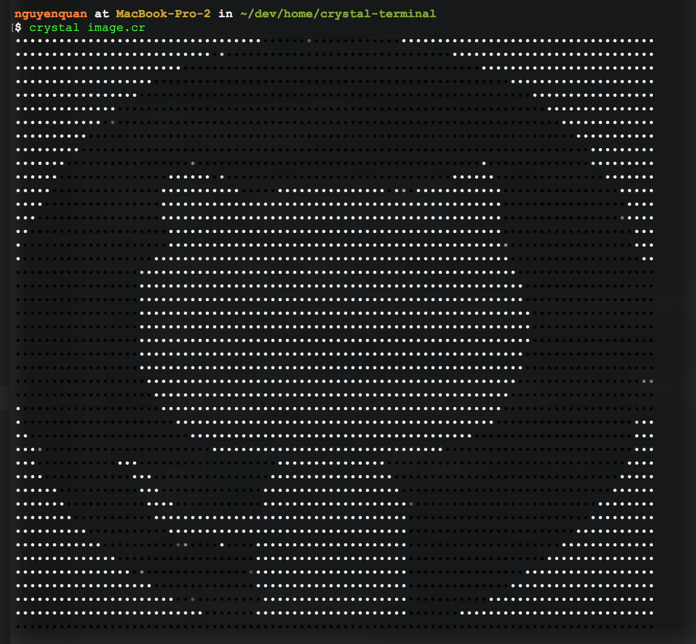

# crystal-terminal-image.cr

### Introduction

Simple code help to read, resize and print image in **Terminal** write by Crystal Lang 💎.

### Usage

```
crystal deps
crystal image.cr
```

**Bonus: 256 colors**

```
crystal 256colors.cr
```

### Demo



